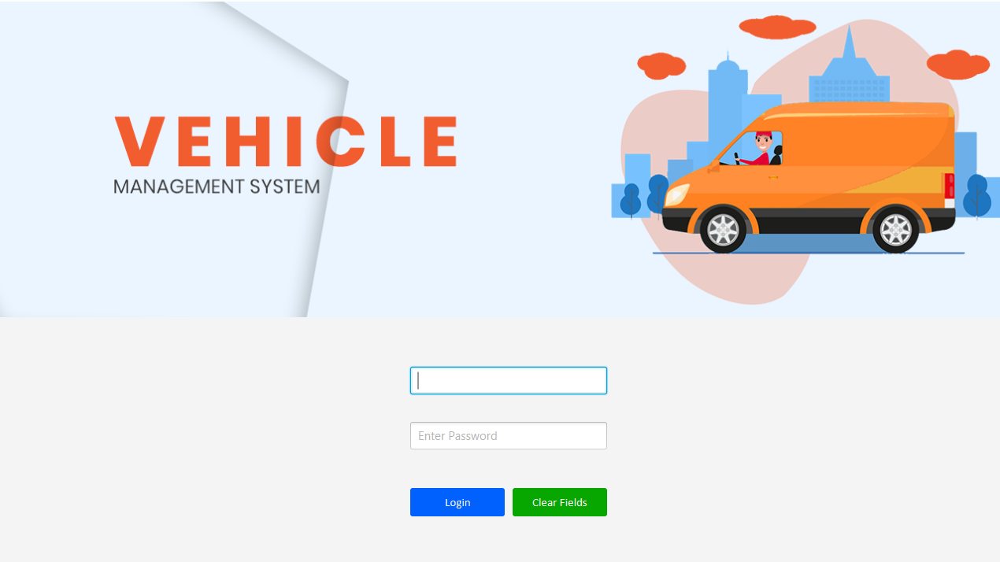
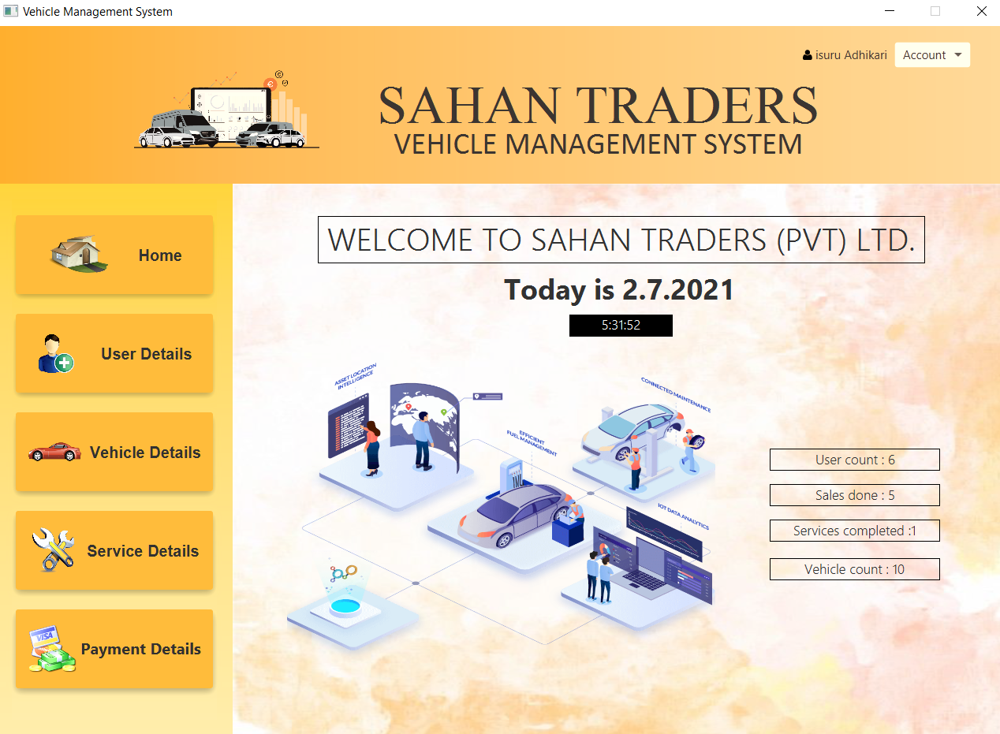

# JavaFX_Vehicle_Managment_System

This is a project me and my team created as our OOP project in our 2nd year. This is a desktop application created based on MVC (Model, View, Controller) Architecture. 

We have used following applications when creating our project;
1. JavaFX as platform
2. IntelliJ as IDE
3. SceneBuilder as GUI developer
4. MySQL as database

## Modules
There are mainly 4 modules we focused on this.

**User Management**

Only *Admin* can add a user, update, modify or delete. Also the passwords are encrypted. 

**Vehicle Management**

*Admin* or *employers* can add a vehicles, update, modify or delete. Primary key is added to the registration number of the vehicle.

**Services Management**

The services done to a vehicle is recorded.

**Payment Management**

Payments are recorded. The vehicle isn't removed from the list but status changed to sold.  

## How to setup the project
- Install IntelliJ
- Open this project (Unzip the zip file)
- Add the libraries that are given in the Libraries Folder
- Admin account = xyz@yahoo.com pswd = 1234 

